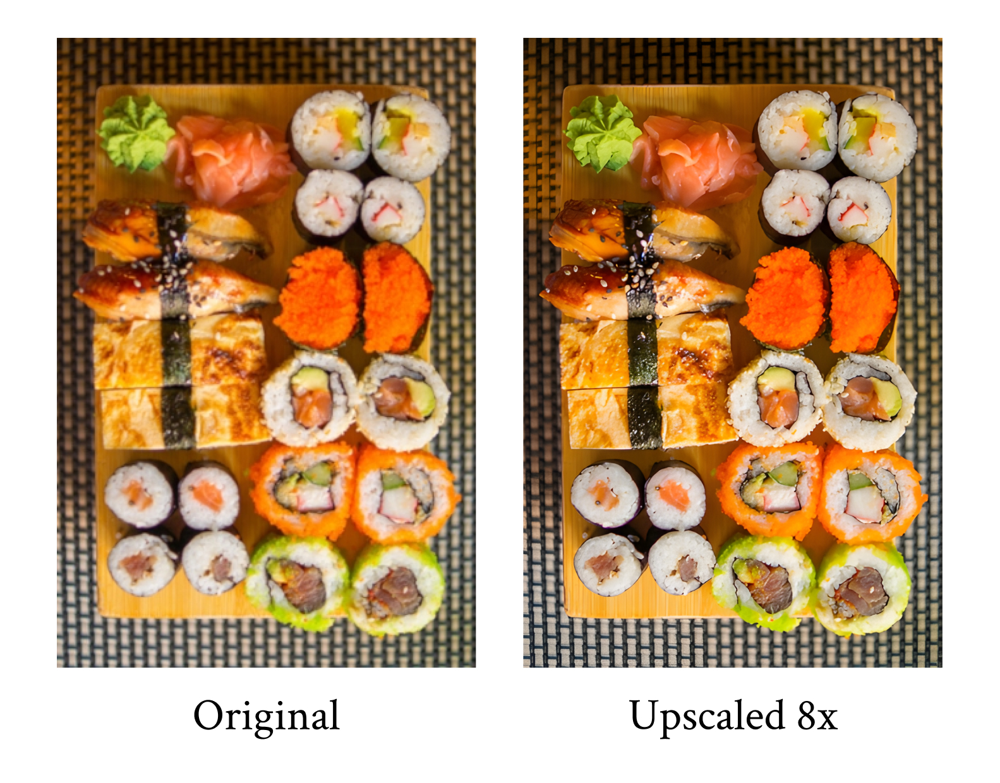
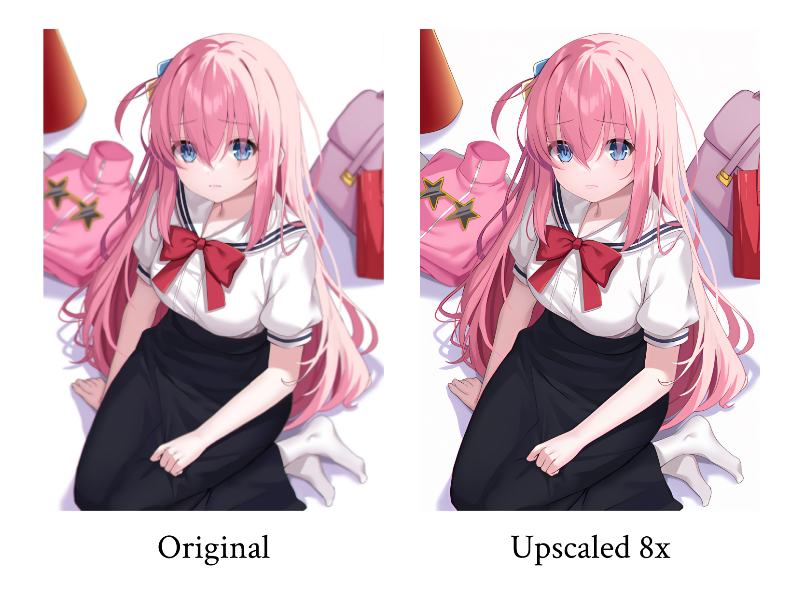

# SuperImage
**Sharpen your low-resolution pictures with the power of AI upscaling**  
SuperImage is a neural network based image upscaling application for Android built with the [MNN deep learning framework](https://github.com/alibaba/MNN) and [Real-ESRGAN](https://github.com/xinntao/Real-ESRGAN).  

The input image is processed in tiles on the device GPU, using a pre-trained Real-ESRGAN model. The tiles are then merged into the final high-resolution image. This application requires Vulkan or OpenCL support and Android 7 or above

## 🖼 Samples

  
  
  

## 📊 Benchmarks
Results on Qualcomm Snapdragon 855 (Vulkan)
| Mode          | Input resolution | Output resolution | Execution time    |
|---------------|------------------|-------------------|-------------------|
| 4x (generic)  | 1920x1080        | 3840x2160         | 3 minutes         |
| 8x (generic)  | 1920x1080        | 7680x4320         | 11 minutes        |
| 8x (drawing)  | 1920x1080        | 7680x4320         | 3 mins 42 seconds |

## 📱 Screenshots

  &nbsp;
  
  &nbsp;&nbsp;
  
  &nbsp;

## 協 Contribute
You can submit feedbacks or bug reports by [opening an issue](https://github.com/Lucchetto/SuperImage/issues/new). Pull requests are welcome !

## 📚 TODO
- Support images with transparency
- Batch processing
- Web and desktop versions

## 📝 Credits
- Pre-trained models and original implementation from [Real-ESRGAN](https://github.com/xinntao/Real-ESRGAN)
- Pictures by [Satoshi Hirayama](https://www.pexels.com/photo/yasaka-pagoda-in-kyoto-7526805), [Skitterphoto](https://www.pexels.com/photo/food-japanese-food-photography-sushi-9210), [天江ひなた](https://www.pixiv.net/en/artworks/103802719) and [Ryutaro Tsukata](https://www.pexels.com/photo/an-illuminated-lanterns-on-the-street-5745029)

## ⚖️ License
SuperImage is licensed under the [GNU General Public License v3.0](https://www.gnu.org/licenses/gpl-3.0.html)
